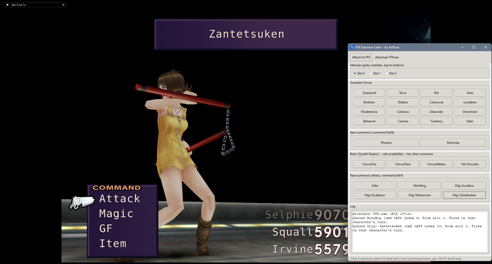

# FF8 Summon Caller

FF8 Summon Caller lets any party member call any summon in Final Fantasy VIII, right on their turn. It's made for modders working on summons, like their music, sound effects, voices, models or effects, so you can see and hear any summon when you need to instead of waiting for it to come up in the game.

It covers all 16 Guardian Forces, Phoenix and Moomba, Boko with any of his four attacks, and the ones that are normally hard to get on screen: Odin, MiniMog, and all four of Gilgamesh's swords (Excalibur, Excalipoor, Masamune and Zantetsuken).

It's a testing tool for modders, not a trainer. When you click a summon, it writes that action into the game's list of pending battle actions for the character you picked, the same way the battle menu does, and the game runs it on that character's turn. For Boko it also turns him on and sets which attack comes out. Nothing else in the game's memory is touched.

It pairs well with [FF8 Battle Teleport](https://github.com/AxlRose-RX/FF8-Battle-Teleport): jump into the battle you want, then call the summon you want to test.

It has been tested with FFNx and the Junction VIII mod manager, on Final Fantasy VIII Remastered and the original 2013 Steam version, and with Final Fantasy VIII Remastered launched on its own, without Junction VIII. Those are the only setups it supports.

## Download

Get `ff8_summon_caller.zip` from the [latest release](https://github.com/AxlRose-RX/FF8-Summon-Caller/releases/latest), unzip it anywhere and run `ff8_summon_caller.exe`. Keep the `_internal` folder next to the .exe.

Because it writes to the game's memory, some antivirus programs may flag it. The full source is here if you want to check it or build it yourself.

## How to use

1. Start the game through Junction VIII (or just launch the Remastered version on its own) and get into a battle.
2. Click **Attach to FF8**.
3. Pick who casts it: **Slot 0**, **1** or **2** are your party members, top to bottom.
4. When it's that character's turn and their command menu is up, click a summon.

If nothing happens, it probably wasn't that character's turn yet. Click it again once their menu is up.

## Build it yourself

Download **Source code (zip)** from any release, install [Python 3](https://www.python.org/downloads/) and double-click `build_exeonedir.bat`. It installs everything it needs and builds the app into `dist\ff8_summon_caller`.

## Credits

Made by AxlRose. Claude (Anthropic's AI) helped write the code. [TrueOdin](https://github.com/julianxhokaxhiu) added support for the Remastered version without Junction VIII.

Questions and bug reports: [Tsunamods Discord](https://discord.com/invite/7Rsvsewghz)
